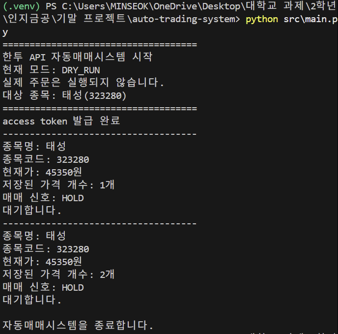

1. 프로젝트 소개
   
수업에서 배운 한국투자증권 Open API 사용 방법을 바탕으로 만든 자동매매시스템입니다.

수업에서 한국투자증권 API를 이용해 access token을 발급받고, 국내 주식 현재가를 조회하는 방법을 배웠습니다. 저는 이 내용을 바탕으로 태성(323280)의 현재가를 가져오고, 가격 데이터를 이용해서 BUY, SELL, HOLD 신호를 출력하는 프로그램을 만들었습니다.

실제 주문이 바로 실행되면 위험할 수 있기 때문에, 이 프로젝트에서는 실제 매수와 매도 주문은 넣지 않고 DRY_RUN 방식으로 매매 신호만 출력되도록 했습니다.

2. 파일 설명
   
config.py는 .env 파일에 저장한 API Key와 API Secret을 불러오는 파일입니다.

kis_auth.py는 한국투자증권 Open API를 사용하기 위해 access token을 발급받는 파일입니다.

kis_rest.py는 태성(323280)의 현재가를 조회하는 파일입니다.

strategy.py는 최근 가격 데이터를 이용해서 BUY, SELL, HOLD 신호를 만드는 파일입니다.

trader.py는 매수와 매도 신호가 나왔을 때 처리하는 파일입니다. 현재는 실제 주문이 아니라 DRY_RUN으로만 동작합니다.

main.py는 전체 자동매매시스템을 실행하는 파일입니다.

3. 실행 방법

 1) 가상환경 생성
    py -m venv .venv
 2) 가상환경 실행
    .venv\Scripts\activate
 3) 필요한 라이브러리 설치
    pip install -r requirements.txt
 4) 환경변수 설정
    .env 파일을 만들고 아래와 같이 입력합니다.
    KIS_APP_KEY=your_app_key_here
    KIS_APP_SECRET=your_app_secret_here
    KIS_ENV=virtual
 5) access token 발급 확인
    python src\kis_auth.py
 6) 현재가 조회 확인
    python src\kis_rest.py
 7) 자동매매시스템 실행
    python src\main.py

4. 매매

최근 5개의 가격을 저장한 뒤, 현재 가격이 최근 평균보다 높은지 낮은지를 비교해서 매매 신호를 만들었습니다.

현재 가격이 최근 평균보다 높으면 BUY 신호를 출력하고, 현재 가격이 최근 평균보다 낮으면 SELL 신호를 출력합니다. 큰 차이가 없으면 HOLD 신호를 출력합니다.

수업에서 배운 API 사용 방법을 바탕으로 가격 조회부터 매매 신호 생성까지 이어지는 자동매매시스템의 기본 구조를 구현해보았습니다.

5. 실행 결과
   
아래는 태성(323280)을 대상으로 자동매매시스템을 실행한 결과입니다.

